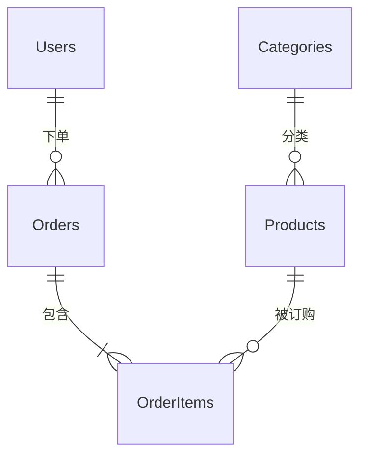

# 数据库 Schema 设计指南

## 使用时机

- **新项目**：为新应用设计数据库
- **Schema 重构**：为性能或可扩展性重新设计
- **关系定义**：实现 1:1、1:N、N:M 关系
- **迁移**：安全地应用 Schema 变更
- **性能问题**：索引和 Schema 优化以解决慢查询

## 需要收集的信息

### 必需信息
- **数据库类型**：PostgreSQL、MySQL、MongoDB、SQLite 等
- **业务领域**：存储什么数据（如电商、博客、社交媒体）
- **核心实体**：关键数据对象（如用户、商品、订单）

### 可选信息
- **预期数据量**：小（<1万行）、中（1万-100万）、大（>100万），默认：中
- **读写比例**：读多写少、写多读少、均衡，默认：均衡
- **事务要求**：是否需要 ACID，默认：是
- **分片/分区**：是否需要大数据分布，默认：否

## 操作步骤

### 第一步：定义实体和属性

识别核心数据对象及其属性。

**任务**：
- 从业务需求中提取名词 → 实体
- 列出每个实体的属性（字段）
- 确定数据类型
- 指定主键策略（UUID vs 自增 ID）

### 第二步：设计关系和范式化

定义表之间的关系并应用范式化。

**关系类型**：
- 1:1 关系：外键 + UNIQUE 约束
- 1:N 关系：外键
- N:M 关系：创建中间表

**决策标准**：
- OLTP 系统 → 范式化到 3NF（数据完整性）
- OLAP/分析系统 → 允许反范式化（查询性能）
- 读多 → 通过部分反范式化减少 JOIN
- 写多 → 完全范式化消除冗余

**ER 图示例**（Mermaid）：


### 第三步：制定索引策略

**规则**：
- 主键自动创建索引
- WHERE 子句中频繁使用的字段 → 添加索引
- JOIN 用到的外键 → 添加索引
- 考虑复合索引（按选择性从高到低排列）
- 唯一字段 → UNIQUE 索引

**检查清单**：
- [ ] 频繁查询的字段有索引
- [ ] 外键字段有索引
- [ ] 复合索引列顺序正确（高选择性列在前）
- [ ] 避免过多索引（影响 INSERT/UPDATE 性能）

**示例**：
```sql
CREATE INDEX idx_orders_user_id ON orders(user_id);
CREATE INDEX idx_orders_status ON orders(status);
CREATE INDEX idx_orders_status_created ON orders(status, created_at DESC);
```

### 第四步：设置约束

**任务**：
- NOT NULL：必填字段
- UNIQUE：必须唯一的字段
- CHECK：值范围约束（如 price >= 0）
- 外键 + CASCADE 选项
- 设置默认值

### 第五步：编写迁移脚本

**任务**：
- UP 迁移：应用变更
- DOWN 迁移：回滚
- 使用事务包裹
- 防止数据丢失（谨慎使用 ALTER TABLE）

## 强制规则

### 必须遵守

1. **必须有主键**：每张表都必须定义主键
2. **显式外键**：有关系的表必须定义外键，并指定 ON DELETE 策略
3. **合理使用 NOT NULL**：必填字段必须设为 NOT NULL

### 禁止事项

1. **滥用 EAV 模式**：Entity-Attribute-Value 模式只在特殊情况使用
2. **过度反范式化**：反范式化要谨慎，避免数据一致性问题
3. **明文存储敏感数据**：禁止明文存储密码、卡号等，必须哈希/加密

### 安全规则

- **最小权限原则**：应用数据库账号只授予必要权限
- **防 SQL 注入**：使用参数化查询 / 预编译语句
- **加密敏感字段**：考虑对个人信息进行静态加密

## 常见问题

### 问题 1：N+1 查询

**症状**：一个查询能解决的事，却发了 N+1 次查询

**解决**：
```sql
-- ❌ 错误：循环中逐个查询
SELECT * FROM posts;
-- 循环中
SELECT * FROM users WHERE id = ?;

-- ✅ 正确：一次 JOIN 查询
SELECT posts.*, users.username
FROM posts
JOIN users ON posts.author_id = users.id;
```

### 问题 2：外键无索引导致 JOIN 慢

**解决**：
```sql
CREATE INDEX idx_orders_user_id ON orders(user_id);
CREATE INDEX idx_order_items_order_id ON order_items(order_id);
```

### 问题 3：UUID vs 自增主键性能

**症状**：UUID 主键导致插入性能下降

**解决**：
- PostgreSQL：使用 `uuid_generate_v7()`（时间有序 UUID）
- 或考虑使用自增 BIGINT

## 最佳实践

1. **命名一致**：表名用小写复数 snake_case（users, post_tags）
2. **软删除**：重要数据用 `deleted_at` 逻辑删除而非物理删除
3. **时间戳必备**：大多数表都应有 `created_at` 和 `updated_at`
4. **部分索引**：用条件索引减小索引体积
5. **分区**：大表按日期/范围分区

## 模板引用

- 输出物：实体清单、关系图、索引策略、迁移脚本草稿、风险说明

### 示例：订单系统表设计

- 输入：用户、订单、订单项、商品等核心实体
- 输出：表结构、关系、索引建议、迁移注意事项
- 约束：金额字段必须使用定点数，不得使用浮点数

## 维护信息

- 来源：关系型数据库范式化实践、常见迁移策略、AI-OS 数据层约束
- 更新时间：2026-03-15
- 已知限制：本 Skill 提供设计基线，不直接替代 DBA 审核或生产迁移审批
